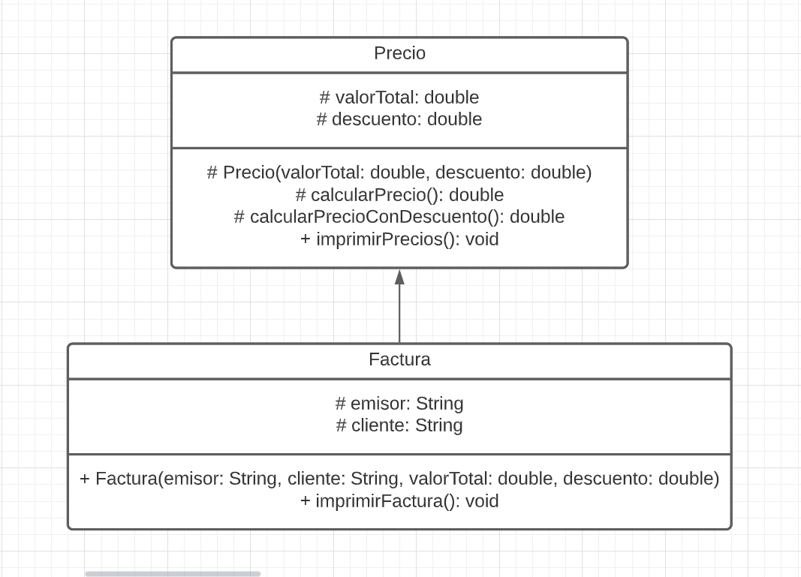
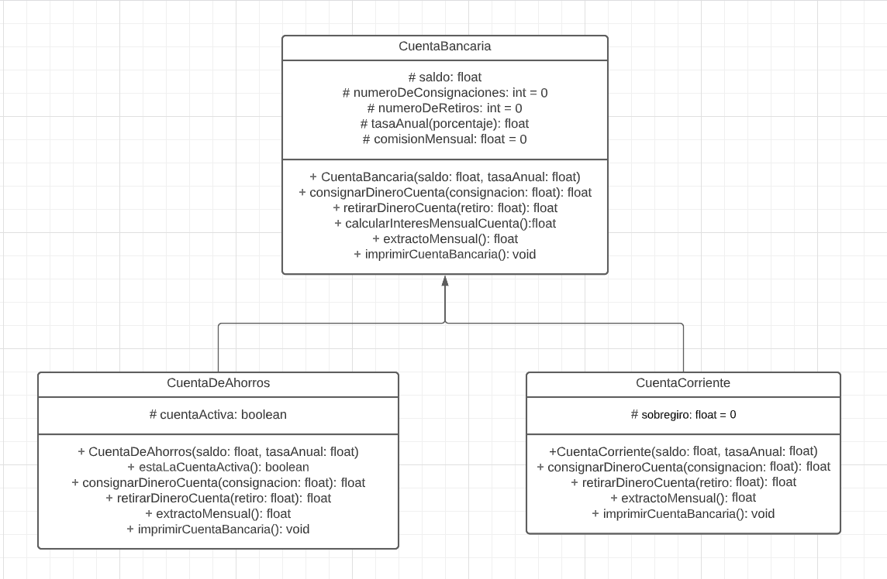
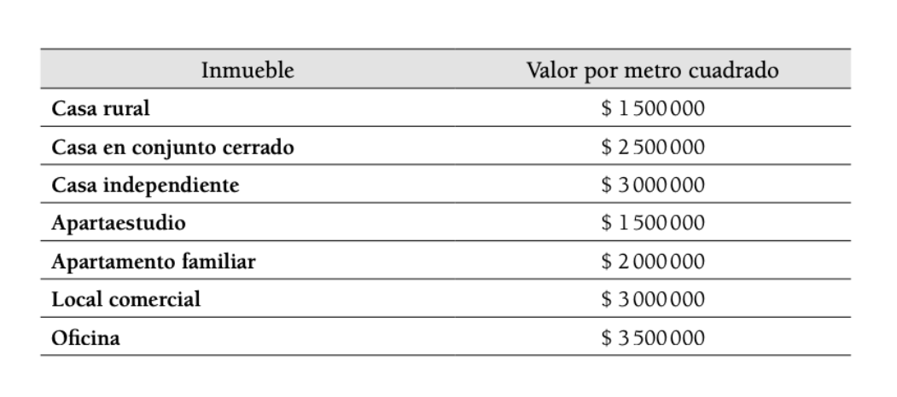
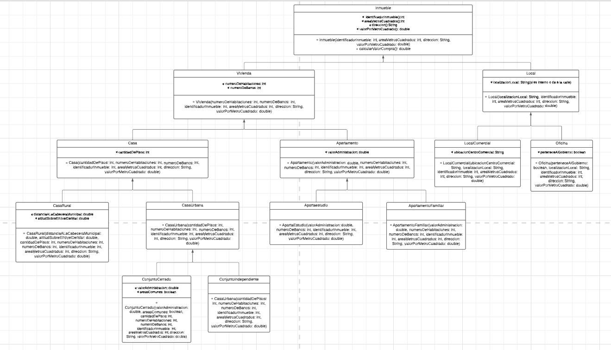

# Diagramas UML
## 1).  
Descripción del ejercicio:

Construir una clase Factura que descienda de la clase Precio y que incluya dos atributos específicos llamados emisor y cliente y, al menos, un método llamado imprimirFactura.

### Diagrama del ejercicio 1

## 2).  
Descripción del ejercicio:

Desarrollar un programa que modele una cuenta bancaria que tiene los
siguientes atributos, que deben ser de acceso protegido:  

Saldo, de tipo float, Número de consignaciones con valor inicial cero, de tipo int.
Número de retiros con valor inicial cero, de tipo int.
Tasa anual (porcentaje), de tipo float.
Comisión mensual con valor inicial cero, de tipo float.  

La clase Cuenta tiene un constructor que inicializa los atributos saldo
y tasa anual con valores pasados como parámetros.  

La clase Cuenta tiene los siguientes métodos:  

1. Consignar una cantidad de dinero en la cuenta actualizando su saldo.  

2. Retirar una cantidad de dinero en la cuenta actualizando su saldo.
El valor a retirar no debe superar el saldo.  

3. Calcular el interés mensual de la cuenta y actualiza el saldo correspondiente.  

4. Extracto mensual: actualiza el saldo restándole la comisión mensual
y calculando el interés mensual correspondiente (invoca el método anterior).  

5. Imprimir: muestra en pantalla los valores de los atributos.

La clase Cuenta tiene dos clases hijas:  

Cuenta de ahorros:

posee un atributo para determinar si la cuenta de ahorros está activa (tipo boolean). 
Si el saldo es menor a $10000,la cuenta está inactiva, en caso contrario se considera activa.  

Los siguientes métodos se redefinen:

1. Consignar: se puede consignar dinero si la cuenta está activa.
Debe invocar al método heredado.

2. Retirar: es posible retirar dinero si la cuenta está activa. Debe
invocar al método heredado.

3. Extracto mensual: si el número de retiros es mayor que 4, por
cada retiro adicional, se cobra $1000 como comisión mensual.
Al generar el extracto, se determina si la cuenta está activa o no
con el saldo.

4. Un nuevo método imprimir que muestra en pantalla el saldo
de la cuenta, la comisión mensual y el número de transacciones
realizadas (suma de cantidad de consignaciones y retiros).

Cuenta corriente: 

posee un atributo de sobregiro, el cual se inicializa en cero. Se redefinen los siguientes métodos:

1. Retirar: se retira dinero de la cuenta actualizando su saldo. Se puede retirar dinero superior al saldo. El dinero que se debe queda
como sobregiro.

2. Consignar: invoca al método heredado. Si hay sobregiro, la
cantidad consignada reduce el sobregiro.

3. Extracto mensual: invoca al método heredado.

4. Un nuevo método imprimir que muestra en pantalla el saldo
de la cuenta, la comisión mensual, el número de transacciones
realizadas (suma de cantidad de consignaciones y retiros) y el
valor de sobregiro.

Realizar un método main que implemente un objeto Cuenta de ahorros y llame a los métodos correspondientes.

### Diagrama del ejercicio 2

## 3).  
Descripción del ejercicio:

Se requiere realizar un programa que modele diferentes tipos de inmuebles.
Cada inmueble tiene los siguientes atributos:

identificador inmobiliario (tipo entero); área en metros cuadrados (tipo entero) y dirección (tipo String).
Los inmuebles para vivienda pueden ser casas o apartamentos.

Los inmuebles para vivienda tienen los siguientes atributos:

número de habitaciones y número de baños. Las casas pueden ser casas rurales o casas urbanas, su atributo es la cantidad de pisos que poseen.

Los atributos de las casas rurales son la distancia a la cabecera municipal y la altitud sobre el nivel del mar.
Las casas urbanas pueden estar en un conjunto cerrado o ser independientes.
 
A su vez, las casas en conjunto cerrado tienen como atributo el valor de la administración y si incluyen o no áreas comunes como piscinas y campos deportivos. 

De otro lado, los apartamentos pueden ser apartaestudios o apartamentos familiares. Los apartamentos pagan un valor de administración, mientras que los aparta estudios tienen una sola habitación.

Los locales se clasifican en locales comerciales y oficinas. Los locales tienen como atributo su localización (si es interno o da a la calle).

Los locales comerciales tienen un atributo para conocer el centro comercial donde
están establecidos.

Las oficinas tienen como atributo un valor boolean para determinar si son del Gobierno.

Cada inmueble tiene un valor de compra.Este depende del área de cada inmueble según la tabla.

### Tabla de valores de metros cuadrados por inmueble

### Diagrama del ejercicio 3
